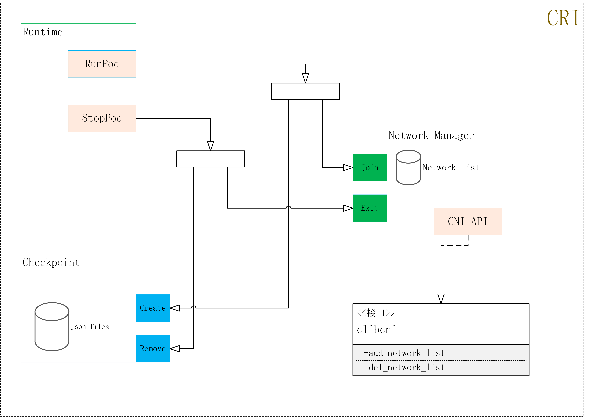

# iSulad Architecture

## Overview

iSulad是一个基于OCI标准的容器运行引擎，强调简单性、健壮性和轻量化。

作为守护进程，iSulad提供容器生命周期管理相关服务：包括镜像的传输和存储、容器执行和监控管理、容器资源管理以及网络等。iSulad对外提供与docker类似的CLI命令行接口，可使用该命令行进行容器管理；并且提供符合CRI接口标准的gRPC API，可供kubernetes 按照CRI接口协议调用。

为了方便理解，我们将iSulad分成不同的模块，并根据模块的类别组织成子系统。了解这些模块、子系统及其关系是修改和扩展iSulad的关键

本文档将仅描述各个模块的high-level功能设计。有关每个模块的详细信息，请参阅相关设计文档。

## 子系统

用户可通过调用子系统提供的GRPC API与iSulad进行交互。

- **image service** :   镜像管理服务，提供镜像相关操作，如镜像下载、查询、删除等
- **execution service**:  容器生命周期管理服务，提供容器的相关操作，如容器创建、启动、删除等
- **network**：网络子模块负责CRI的Pod的网络管理能力。当Pod启动时，通过CNI的接口把该Pod加入到配置文件制定的网络平面中；当Pod停止时，通过CNI的接口把该Pod从所在的网络平面中退出，并且清理相关的网络资源。

## 模块

- **image content** :   管理镜像元数据以及容器文件系统。

- **resource manage**:  容器资源管理，如设置可用cpu、memory等资源限制

- **Executor**：执行实际容器操作的runtime，提供lcr作为默认runtime，可通过plugin机制扩展

- **Events**：容器事件收集

- **Plugins**：提供插件机制，通过不同插件，实现扩展容器功能。

- **HA**：提供日志机制用于定位问题，提供garbage collect 机制回收容器D/Z 等异常容器资源。

### 网络架构设计

架构图，如下：

